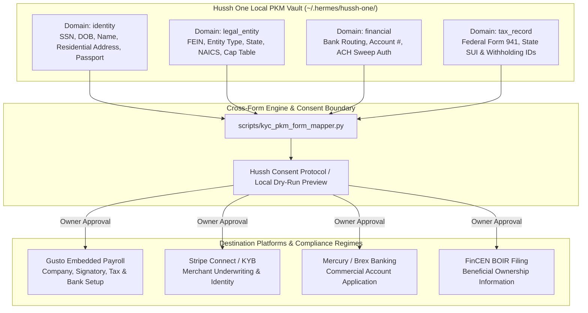

# Feature — Cross-Form KYC/KYB & Onboarding Knowledge Base

## Visual Map

## What it does
Provides a unified, sovereign, cross-form compliance and onboarding engine built on the **Hussh One Personal Knowledge Model (PKM)**. Instead of manually re-entering sensitive KYC, KYB, tax, and banking details across every SaaS, payroll, bank, and regulatory service, Hussh One retains verified user attributes in encrypted local domains (`identity`, `legal_entity`, `financial`, `tax_record`). When an onboarding questionnaire or compliance form is encountered (such as **Gusto Employer Onboarding** or **FinCEN BOIR**), Hussh One maps the relevant domain attributes into target API payloads, validates formatting, presents a dry-run preview, and completes the filing under explicit owner consent.

## Why it matters
- **Eliminates Repetitive Data Entry:** Employers, founders, and individuals spend hours copying EINs, state tax IDs, bank routing numbers, and identity details across dozens of siloed applications.
- **Prevents Costly Compliance Errors:** Transcribing incorrect SUI rates, transposed EIN digits, or mismatched legal entity names triggers payroll tax freezes, delayed bank approvals, and regulatory penalties.
- **Enforces Least-Privilege Data Sovereignty:** Third-party services receive only the exact scoped fields required for their regulatory mandate. Full private identity credentials remain sealed inside local Keychain-backed custody.

## How it works
1. **Canonical PKM Domains:**
   - `identity`: Natural person KYC data (Legal Name, DOB, SSN/ITIN, Residential Address, Passport/Driver's License refs).
   - `legal_entity`: Corporate KYB details (Legal Business Name, DBA, Entity Type, FEIN, NAICS/SIC, State of Formation, Registered Office, Beneficial Ownership / Cap Table).
   - `financial`: Banking records (Account Holder Name, Bank Name, Routing Number, Account Number, ACH Sweep Authorization, Voided Check refs).
   - `tax_record`: Tax registrations (Federal Form 941/944 election, Form 8655 authorization, State SUI Account Numbers, SUI Tax Rates, Withholding IDs).

2. **Deterministic Mapping:**
   `skills/mcp/hussh-one-pkm-kyc-engine/scripts/kyc_pkm_form_mapper.py` standardizes input fields, cleans formats (e.g., unhyphenated 9-digit SSN/FEIN), and constructs service-specific payloads.

3. **Consent & Dry-Run Preview:**
   Before any external API call or automated form submission, the agent outputs a formatted dry-run preview masking sensitive digits. The human must review and confirm before submission.

## Gusto Employer Onboarding Reference

Gusto requires seven specific API objects during employer onboarding:
1. `POST /v1/companies` (Legal & Trade Name)
2. `PUT /v1/companies/{id}/federal_tax_details` (FEIN, Legal Name, Entity Tax Type, Form 941/944)
3. `PUT /v1/companies/{id}/industry_selection` (6-digit NAICS, 4-digit SIC)
4. `POST /v1/companies/{id}/signatories` (Primary Officer KYC: Name, DOB, SSN, Home Address, Title)
5. `POST /v1/companies/{id}/bank_accounts` (Routing, Account #, Checking/Savings)
6. `POST /v1/companies/{id}/locations` (Principal Work Location)
7. `PUT /v1/companies/{id}/tax_requirements/{state}` (State Withholding ID, SUI Employer Account Number, SUI Tax Rate %)

Full technical details and API payloads are documented in `skills/mcp/hussh-one-pkm-kyc-engine/references/gusto-employer-onboarding-spec.md`.

## Cross-Platform Mapping Matrix

| Attribute | Gusto Payroll | Stripe Connect | Mercury / Brex | FinCEN BOIR |
| :--- | :--- | :--- | :--- | :--- |
| Legal Name | `name` | `company.name` | `business.legal_name` | `reporting_company.legal_name` |
| FEIN | `ein` | `company.tax_id` | `business.ein` | `reporting_company.tax_id_number` |
| Signatory Name | `signatory.first_name` | `person.first_name` | `signatory.first_name` | `beneficial_owner.name` |
| Signatory SSN | `signatory.ssn` | `person.id_number` | `signatory.ssn` | `beneficial_owner.id_doc` |
| Signatory DOB | `signatory.birthday` | `person.dob` | `signatory.dob` | `beneficial_owner.dob` |
| Bank Routing / Acct | `bank_accounts` | `external_account` | N/A | N/A |
| SUI / State Tax | `tax_requirements` | N/A | N/A | N/A |

## Authority Boundaries & Privacy
- **Mandatory Storage Confirmation:** Whenever storing, populating, or mutating PKM records from external channels (Gmail, Cloud Storage, or APIs), the agent MUST provide a structured dry-run breakdown detailing the exact target domains, scope paths, masked PII values, source provenance, and downstream form mappings.
- **No Unapproved Submissions:** All automated writes require explicit interactive approval.
- **Local Decryption Only:** PKM attributes are decrypted in-process on the local trusted device. Raw keys and plaintext secrets never touch external logging infrastructure.
- **Audit Logging:** Every generated payload and submission receipt is recorded with cryptographic timestamps in the local profile.

## Shipped Assets
- **Skill:** `skills/mcp/hussh-one-pkm-kyc-engine/SKILL.md`
- **Schema:** `skills/mcp/hussh-one-pkm-kyc-engine/references/canonical-kyc-pkm-schema.json`
- **Gusto Spec:** `skills/mcp/hussh-one-pkm-kyc-engine/references/gusto-employer-onboarding-spec.md`
- **Cross-Form Matrix:** `skills/mcp/hussh-one-pkm-kyc-engine/references/cross-form-mapping-matrix.md`
- **Mapper Script:** `skills/mcp/hussh-one-pkm-kyc-engine/scripts/kyc_pkm_form_mapper.py`
- **Tests:** `tests/skills/test_hussh_one_pkm_kyc_engine_skill.py`
