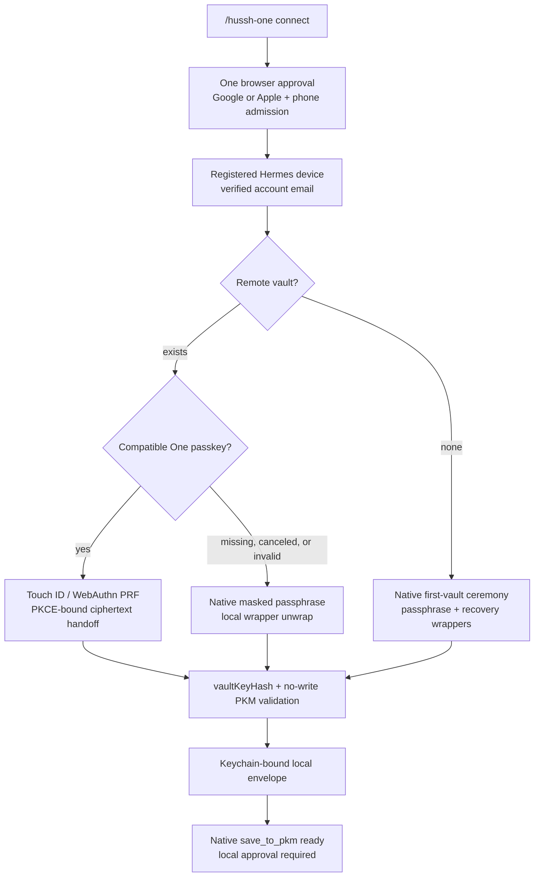

# Feature — Trusted-Device PKM Bridge

## Visual Map



## What it does

Optionally links one Hermes profile to a Hussh One account in UAT. The user
approves the Mac as a trusted device in the browser, then either enters the
existing vault passphrase, reuses an RP-compatible One passkey, or creates a
first vault through protected macOS prompts. Hermes shows the verified account
email locally and receives a narrow native Desktop write capability for
explicitly approved PKM writes.

## How it works

- `hermes_cli/hussh_one_pkm/client.py` owns Authorization Code + PKCE, Firebase
  native token exchange, the registered P-256 device key, and Keychain refresh
  credential.
- `bridge.py` unwraps the existing passphrase wrapper locally and stores only a
  device-bound encrypted vault-key envelope in the active profile.
- When the approval browser has a compatible One passkey, it unwraps and
  hash-validates the same vault key locally, seals it to an ephemeral Hermes
  X25519 key, and attaches ciphertext only to the pending authorization. The
  existing PKCE exchange consumes and returns that ciphertext exactly once.
  Hermes revalidates the key hash before creating its normal local envelope.
  A missing, canceled, stale, or incompatible passkey immediately falls back
  to the protected passphrase prompt.
- `pkm.py` preserves the current PKM v6 ciphertext, manifest,
  `PkmMutationPlanV2`, validation-only, sharing-impact, and optimistic
  concurrency contracts.
- `read_my_pkm` and `save_to_pkm` are the owner's native vault lane on local
  Desktop and loopback TUI/dashboard sessions. Reads decrypt only in process;
  create, update, merge, and delete operations remain guarded by the existing
  Hermes approval surface.
- The hosted Hussh Consent MCP remains a separate external-sharing lane for
  other agents and recipients. Native owner CRUD does not request consent and
  does not change the hosted MCP handshake.
- Desktop onboarding remains optional and profile-scoped. It is available both
  during first-run setup and after upgrade through **Settings → Hussh One**, the
  **Hussh One** sidebar item, or the explicit local `/hussh-one` chat command.
- Setup and vault management endpoints accept loopback workstation requests
  only. Remote conversations do not receive the native connector, and a remote
  dashboard cannot transport the passphrase or manage local key material.

## Authority boundaries

1. Firebase proves account identity.
2. The P-256 device signature proves this Hermes installation.
3. The locally unwrapped vault key enables cryptographic PKM work.
4. A short-lived device-bound `VAULT_OWNER` capability authorizes a mutation.
5. Every commit still requires the existing Hermes local approval surface.

A Hussh developer token supplies none of these authorities.

The trusted-device registration and Keychain-bound local custody are durable
until lock, disconnect, or revocation. Hermes automatically reuses or renews
the short-lived owner capability in memory, so its 15-minute lease is not a
15-minute device enrollment or vault-access limit.

## Local custody

- Device signing key, Firebase refresh credential, and random vault-envelope
  wrapping key: macOS Keychain.
- Encrypted vault-key envelope and non-secret identity metadata: active Hermes
  profile with owner-only file permissions.
- Unwrapped vault key and ID/owner tokens: process memory only. A new local
  process may restore the key from its Keychain-bound envelope while the
  profile and macOS workstation remain unlocked.
- Current PKM replica: ciphertext snapshots plus a metadata-only mutation
  cursor in the active profile with owner-only permissions.
- Vault passphrase: transient native-prompt input only; never configuration,
  renderer state, MCP, environment, log, trace, screenshot, or model context.
- Passkey PRF result and ephemeral X25519 private key: process memory only for
  the active enrollment attempt. The backend sees only short-lived ciphertext
  bound to the authorization, account, device, environment, wrapper, RP ID,
  expiry, and vault-key hash.

The vault clears on explicit lock, macOS workstation lock, device
authorization failure, and revocation. There is no arbitrary 15-minute vault
timeout. Revocation blocks new owner capabilities and the next identity
refresh.

## Read and write behavior

Reads remain PCHP consent requests and scoped encrypted exports. This bridge
does not return a decrypted PKM domain to the agent. Writes are two-step:
proposal, then commit. Commit displays the affected domain/path, human-readable
summary, and current sharing/export impact; it re-reads the source revision and
fails closed if content or sharing changed.

Create, update, merge, path/scope delete, and whole-domain delete use the same
confirmed mutation plan. Whole-domain deletion is compare-and-delete on the
reviewed content revision, emits a durable tombstone, and marks overlapping
continuous encrypted exports for refresh.

Hermes follows a Postgres-backed metadata cursor in the background. An upsert
event causes it to fetch the latest encrypted domain snapshot; a delete event
removes the local ciphertext snapshot. The cloud remains authoritative and the
replica never stores decrypted domain information. The event seam can move to
Redis/Memorystore fan-out later without changing the device protocol.

## Configuration

No vault material is stored in configuration. The first successful enrollment
enables the bundled `read_my_pkm` and `save_to_pkm` native connectors for the
active profile; it does not add a privileged MCP server or alter the hosted MCP
handshake.
Disconnect revokes the server-side device, disables the native connector,
deletes local identity, envelope, and ciphertext-replica state, and removes
related Keychain items.

The product currently selects the immutable UAT bundle:

- One web: `https://uat.one.hushh.ai`
- Account/PKM API: `https://api.uat.hushh.ai`
- Firebase public client identifier: the checked-in UAT value
- Trusted-device admission: backend feature flag plus explicit allowlist

Vault material is never used to select an environment. A later production
switch must use an immutable production bundle, require disconnect and local
custody cleanup first, and reject arbitrary custom origins.

## Browser-to-Hermes handoff

Hermes generates an ephemeral X25519 key pair in process memory together with
the PKCE verifier and state. Only the public key enters the approval request.

After account approval, the browser may:

1. fetch the authenticated encrypted vault state;
2. select the exact compatible passkey wrapper for the current RP;
3. use WebAuthn PRF to unwrap and hash-validate the vault key;
4. seal the vault key using X25519 plus AES-256-GCM;
5. attach ciphertext to the pending authorization.

The existing PKCE exchange atomically consumes the one-time code and returns
the ciphertext only to the process holding the verifier. The authenticated
encryption context binds state, authorization, device, owner, expiry,
vault-key hash, wrapper, RP ID, environment, and recipient public key. Hermes
decrypts in memory, re-reads the remote vault state, validates the hash,
creates the normal local envelope, and erases the ephemeral private key.

If any part of this optional fast path fails, the authorization remains useful
and Hermes immediately opens the protected passphrase prompt. The passkey path
does not create a second vault format or remove the mandatory passphrase and
recovery wrappers.

## Fresh-machine onboarding

Prerequisites:

- macOS with Keychain available;
- a Hussh One UAT account allowed to register a trusted device;
- the existing Hussh vault passphrase;
- a clone of the Hussh One product trunk, `origin/main`.

Install and start the normal Hussh One runtime:

```bash
git clone https://github.com/hushh-labs/hussh-one-hermes.git
cd hussh-one-hermes
scripts/hussh-one-bootstrap.sh --manager auto --start
scripts/hussh-one-doctor.sh --require-services
```

Then launch the bundled Desktop app with `hermes desktop`. On a fresh machine,
use the normal model-confirmation onboarding. On an already configured machine
or after an upgrade, open **Settings → Hussh One**, select **Hussh One** in the
sidebar, or use `/hussh-one` from a local Hermes chat.

1. Select **Connect in browser** and confirm the full verified email shown on
   the Hussh One approval page.
2. Approve the new Mac as a trusted device in the Hussh One UAT surface.
3. Return to Desktop after identity reports connected as that same email.
4. Select **Secure this device**. For an existing vault, the approval browser
   first offers its compatible One passkey. If none exists or that ceremony is
   canceled, enter the vault passphrase in the native macOS protected prompt.
   For a new account, create and confirm a passphrase, then save or copy the
   one-time recovery key in the native recovery window before the vault is
   persisted.
5. Confirm **Vault unlocked locally**. Start a new Desktop chat before asking
   the private agent to save an approved PKM update.

The local TUI/dashboard can perform the same guarded setup without moving a
secret through chat: `/hussh-one connect` opens browser approval, then
`/hussh-one enroll` either secures the existing vault or creates the first one
through native protected prompts. `/hussh-one status` shows the linked verified
email and vault state; `/hussh-one unlock` opens the existing Keychain-bound
envelope without asking for the passphrase again; `/hussh-one lock` clears local vault memory; and
`/hussh-one disconnect` confirms locally, revokes the device, and removes local
custody. None of these commands send a passphrase or recovery key to the model.

### What each command means

| Command | Meaning |
| --- | --- |
| `/hussh-one connect` | Choose and approve a One account in the browser; never accepts an email typed in chat |
| `/hussh-one enroll` | Resume local custody setup; passkey first when available, protected passphrase otherwise |
| `/hussh-one status` | Show the verified email, environment, device, enrollment, lock, and sync state |
| `/hussh-one unlock` | Open the existing Keychain-bound envelope |
| `/hussh-one lock` | Clear the vault key and action capabilities from memory |
| `/hussh-one disconnect` | Confirm locally, revoke the device, and delete profile and Keychain custody |

`connect` proves identity and registers the installation. `enroll` proves
cryptographic access to the existing remote encrypted vault or creates the
account's first vault. A canceled vault prompt therefore leaves the account
connected but the device unenrolled.

Enrollment enables the bundled native connector using the same Python runtime
as Hermes. It does not require cloning another repository, installing a global
Hermes binary, copying a developer token, or placing the vault passphrase in
configuration. Natural-language chat never initiates enrollment automatically:
the explicit command or UI action preserves user control over the browser and
native-password steps.

If UAT authorization, Keychain storage, vault compatibility, or native
connector initialization fails, onboarding remains recoverable and the bridge stays
locked. The rest of Hermes setup continues to work because this feature is
optional.

## Upgrading an existing machine

Update the Hussh One product trunk and rerun the idempotent bootstrap:

```bash
git switch main
git pull --ff-only origin main
scripts/hussh-one-bootstrap.sh --manager auto --start
scripts/hussh-one-doctor.sh --require-services
```

The Python package includes the PKM bridge and its cryptographic golden vectors,
so a normal Hussh One upgrade updates them together. Existing profile metadata,
the encrypted vault-key envelope, and Keychain items remain local and are not
recreated or uploaded. After upgrade, open **Settings → Hussh One** and verify
**Vault unlocked locally**; use **Unlock** if the system was locked or
suspended.

Do not copy another machine's profile directory or Keychain records. A second
machine must complete browser approval and enrollment independently so its
device identity and vault envelope remain bound to that machine.

## Recovery and rollback

- System lock or suspend: reopen Desktop and select **Unlock**.
- Revoked/invalid device: reconnect through browser approval.
- Vault contract mismatch: stop; update Hussh One and the UAT service before
  retrying. Do not rewrite the vault or bypass golden-vector validation.
- Disconnect: use the trusted local control-plane disconnect action. It revokes
  the server-side device, removes the local envelope, and deletes related
  Keychain items.
- Full rollback: disconnect first, then use the normal Hussh One repository
  rollback procedure. Never restore trusted-device secrets from Git.

## Troubleshooting

| Status or symptom | Meaning | Recovery |
| --- | --- | --- |
| `waiting_for_browser_approval` | Loopback callback and PKCE grant are pending | Finish browser approval or restart connect after expiry |
| Connected email shown, no envelope | Identity succeeded; local custody did not | Run `/hussh-one enroll` |
| Touch ID does not appear | No compatible wrapper/RP or browser PRF support | Continue with the native masked passphrase prompt |
| Touch ID succeeds, then passphrase appears | Handoff, hash, or readiness validation failed safely | Enter the existing passphrase; no vault was replaced |
| `vault_setup_canceled` | Native protected UI was canceled | Connection remains; run enroll again |
| `vault_setup_needs_retry` | Wrapper, Keychain, network, or PKM validation failed | Check UAT availability and retry without deleting the remote vault |
| `contract_incompatible` | Client and PKM validation contract disagree | Update Hermes and the UAT backend before writing |
| Device revoked | Refresh and owner-capability issuance fail closed | Disconnect local custody, then reconnect if the Mac remains trusted |

Do not troubleshoot by placing a passphrase in chat, `.env`, `config.yaml`,
shell arguments, logs, or MCP configuration.

## Tests

- Mirrored TypeScript/Python vault golden vector.
- Exact passkey-wrapper selection, PKCE-bound ciphertext handoff, authenticated
  context binding, ephemeral-key cleanup, and protected-passphrase fallback.
- Passphrase failure and envelope identity binding.
- PKCE, code replay, nonce replay, signature, and revocation service tests.
- Proposal safe-result and single-use behavior.
- Encrypted-replica cursor, snapshot permissions, and deletion tombstones.
- Revision-safe whole-domain delete and export refresh invalidation.
- Empty dynamic-scope materialization admission; static capabilities are
  unaffected.
- Existing Hermes approval and Hussh PKM validation/store regression
  suites remain the integration owners.

## Status

🧪 UAT-only, feature-flagged, allowlisted, macOS MVP.
