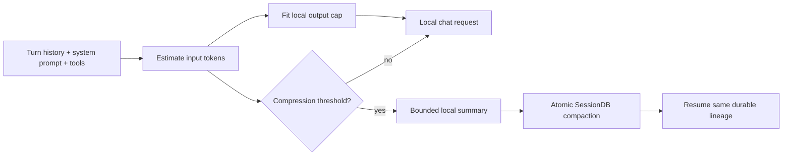

# Local Context Budget and Resumable Compaction

This runbook covers long Hermes sessions running against LM Studio or another
local OpenAI-compatible endpoint. It records the current safeguards for keeping
the prompt and response inside the model's loaded context window while
preserving the session for `/resume`.

## Visual Context



## The failure mode

The context window is shared by the prompt and the model response:

```text
input tokens + reserved output tokens + safety margin <= loaded context length
```

LM Studio may reserve a large completion when `max_tokens` is omitted. In the
observed Hermes sessions, a roughly 70,000-token prompt and a 65,536-token
reservation exceeded the model's 131,072-token window. LM Studio returned the
generic `Context size has been exceeded` error, so the runtime could not infer
that the response reservation was the part that needed reducing.

The following compression attempt then used the same local model. When that
summary call made no progress, the compression commit fence returned the
original transcript unchanged. This is deliberate data protection, but it left
the next request with the same oversized history and produced
`Cannot compress further`.

Large system instructions and tool schemas are part of the input budget. The
preflight estimator counts the system message, conversation messages, and tool
schemas together; a tool registry is not free context.

## Current safeguards

| Safeguard | Source | Behavior |
| --- | --- | --- |
| Per-request local output fitting | `agent/chat_completion_helpers.py` | Estimates the outgoing prompt, leaves a 1,024-token margin, and adds or lowers the local output cap so prompt plus response fits the loaded window. |
| Bounded local compression output | `agent/context_compressor.py` | Sends the computed summary budget to local auxiliary calls instead of allowing a server-sized default reservation. |
| Local auxiliary cap forwarding | `agent/auxiliary_client.py` | Preserves an explicit `max_tokens` on LM Studio/Ollama-compatible auxiliary requests. |
| Atomic compaction boundary | `agent/conversation_compression.py` | A summary either commits a valid SessionDB boundary or leaves the live transcript unchanged. |
| Durable resume | `hermes_state.SessionDB` and `tui_gateway/server.py` | Resume reloads the active compacted transcript and its session metadata from the same durable lineage. |

Hosted providers keep their existing output-cap behavior. The local fitting
logic is selected by the LM Studio/Ollama provider name or by a parsed private
endpoint, so a hosted URL is not silently changed.

## Checkpoint ownership

Hermes has two different checkpoint mechanisms:

1. **Conversation continuity:** SessionDB stores session messages and the
   compacted boundary. This is the authoritative source for `/resume` and
   dashboard reconnects.
2. **File mutation recovery:** the optional checkpoint manager under
   `~/.hermes/checkpoints` snapshots filesystem changes before mutating tools.
   It is not a transcript store.

Temporary files must not become a second source of truth for conversation
history. A summary is only considered resumable after the SessionDB transaction
and compression boundary complete.

## Operating procedure

After deploying or pulling this fix:

```bash
# restart the dashboard process so it loads the new runtime
scripts/hussh-one-supervisor.sh restart --manager launchd

# then resume the existing session id from the dashboard or `hermes --resume`
```

When investigating another overflow, inspect `~/.hermes/logs/agent.log` for:

- the model's loaded context length;
- the estimated prompt size;
- the fitted local output cap;
- `compression_attempt` telemetry and its commit status.

Do not delete `~/.hermes/state.db` to clear this error. If the prompt itself is
larger than the loaded window after output is reduced, the session still needs
successful compaction or a deliberate fresh session; an output cap cannot make
an input-only overflow fit.

## Verification

Run the focused local-budget and compression checks from the repository root:

```bash
pytest -q tests/test_local_context_budget.py tests/test_ctx_halving_fix.py
pytest -q tests/agent/test_context_compressor.py -k 'generate_summary or fallback or summary'
ruff check agent/chat_completion_helpers.py agent/context_compressor.py agent/auxiliary_client.py tests/test_local_context_budget.py
python3 -m py_compile agent/chat_completion_helpers.py agent/context_compressor.py agent/auxiliary_client.py
```

The focused regression suite proves that a local request receives a fitted cap,
that remote requests are unchanged, and that local compression caps reach the
chat-completions wire.

## See also

- [Crash resilience](./crash-resilience.md)
- [Session-model persistence and resume](../features/session-model-resume.md)
- [Puppy One on-device edge compute](../features/puppy-one-edge-compute.md)
