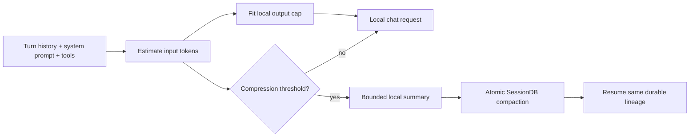

# Local Context Budget and Resumable Compaction

> 2026-09-11: Auto-Dream was deleted from the product and scheduled jobs. References below describe historical investigations, not installation or operating instructions. Core Hermes memory and context compaction remain supported.

This runbook covers long Hermes sessions running against LM Studio or another
local OpenAI-compatible endpoint. It records the current safeguards for keeping
the prompt and response inside the model's loaded context window while
preserving the session for `/resume`.

## Visual Context



## The failure mode

The context window is shared by the prompt and the model response:

```text
input tokens + reserved output tokens + safety margin <= loaded context length
```

LM Studio may reserve a large completion when `max_tokens` is omitted. In the
observed Hermes sessions, a roughly 70,000-token prompt and a 65,536-token
reservation exceeded the model's 131,072-token window. LM Studio returned the
generic `Context size has been exceeded` error, so the runtime could not infer
that the response reservation was the part that needed reducing.

The following compression attempt then used the same local model. When that
summary call made no progress, the compression commit fence returned the
original transcript unchanged. This is deliberate data protection, but it left
the next request with the same oversized history and produced
`Cannot compress further`.

Large system instructions and tool schemas are part of the input budget. The
preflight estimator counts the system message, conversation messages, and tool
schemas together; a tool registry is not free context.

## Current safeguards

| Safeguard | Source | Behavior |
| --- | --- | --- |
| Per-request local output fitting | `agent/chat_completion_helpers.py` | Estimates the outgoing prompt, leaves a 1,024-token margin, and adds or lowers the local output cap so prompt plus response fits the loaded window. |
| Bounded local compression output | `agent/context_compressor.py` | Sends the computed summary budget to local auxiliary calls instead of allowing a server-sized default reservation. |
| Local auxiliary cap forwarding | `agent/auxiliary_client.py` | Preserves an explicit `max_tokens` on LM Studio/Ollama-compatible auxiliary requests. |
| Atomic compaction boundary | `agent/conversation_compression.py` | A summary either commits a valid SessionDB boundary or leaves the live transcript unchanged. |
| Durable resume | `hermes_state.SessionDB` and `tui_gateway/server.py` | Resume reloads the active compacted transcript and its session metadata from the same durable lineage. |

Hosted providers keep their existing output-cap behavior. The local fitting
logic is selected by the LM Studio/Ollama provider name or by a parsed private
endpoint, so a hosted URL is not silently changed.

## Checkpoint ownership

Hermes has two different checkpoint mechanisms:

1. **Conversation continuity:** SessionDB stores session messages and the
   compacted boundary. This is the authoritative source for `/resume` and
   dashboard reconnects.
2. **File mutation recovery:** the optional checkpoint manager under
   `~/.hermes/checkpoints` snapshots filesystem changes before mutating tools.
   It is not a transcript store.

Temporary files must not become a second source of truth for conversation
history. A summary is only considered resumable after the SessionDB transaction
and compression boundary complete.

## Operating procedure

After deploying or pulling this fix:

```bash
# restart the dashboard process so it loads the new runtime
scripts/hussh-one-supervisor.sh restart --manager launchd

# then resume the existing session id from the dashboard or `hermes --resume`
```

When investigating another overflow, inspect `~/.hermes/logs/agent.log` for:

- the model's loaded context length;
- the estimated prompt size;
- the fitted local output cap;
- `compression_attempt` telemetry and its commit status.

Do not delete `~/.hermes/state.db` to clear this error. If the prompt itself is
larger than the loaded window after output is reduced, the session still needs
successful compaction or a deliberate fresh session; an output cap cannot make
an input-only overflow fit.

## Verification

Run the focused local-budget and compression checks from the repository root:

```bash
scripts/run_tests.sh tests/test_local_context_budget.py tests/test_ctx_halving_fix.py
scripts/run_tests.sh tests/agent/test_context_compressor.py -k 'generate_summary or fallback or summary'
ruff check agent/chat_completion_helpers.py agent/context_compressor.py agent/auxiliary_client.py tests/test_local_context_budget.py
python3 -m py_compile agent/chat_completion_helpers.py agent/context_compressor.py agent/auxiliary_client.py
```

The focused regression suite proves that a local request receives a fitted cap,
that remote requests are unchanged, and that local compression caps reach the
chat-completions wire.

## See also

- [Crash resilience](./crash-resilience.md)
- [Session-model persistence and resume](../features/session-model-resume.md)
- [Puppy One on-device edge compute](../features/puppy-one-edge-compute.md)

## Glimmer capacity (verified 2026-09-11)

LM Studio's model catalog and the live native inventory advertise a 131,072-token
window and low/medium/high/xhigh reasoning for Muse Glimmer. The loaded instance
also reports context_length=131072. This is a combined input, reasoning and answer
budget, not a 131,072-token answer allowance.

Local output fitting uses remaining context minus the existing 1,024-token
estimator margin. Explicit positive output limits are preserved unless they
exceed that available space. The earlier arbitrary 8,192/65,536 ceilings and
HERMES_LOCAL_MAX_OUTPUT_TOKENS override are removed; use the existing model.max_tokens
configuration for an intentional smaller output budget. No model reload or
context-extension patch is needed. Rough estimation is not exact tokenization.

Source: https://lmstudio.ai/models/muse-glimmer
This capacity correction alone does not prove successful long-job recovery,
external-action deduplication, or report delivery.

## Reliability implementation status (2026-09-11)

Implemented in the current checkout, pending live rollout:

- Local disconnects and generic HTTP 400 responses no longer become context
  overflow solely because the session is large. Explicit overflow remains a
  compression trigger.
- Streaming checks the attempt deadline before each retry and while waiting;
  deadline expiry closes the request client and uses session persistence.
  Local stale timeouts are independent of that deadline.
- Admission uses the profile's local-runtime.db across CLI, gateway and cron
  processes. Interactive queued requests precede background requests. Capacity
  is pinned per model/endpoint; live claims have no TTL. Dead-process claims
  are reclaimed using PID plus process birth time. This does not prove an
  orphaned server inference has stopped, and does not coordinate different
  Hermes profiles or older already-running processes.
- Chunk digests are checkpointed in state.db, keyed by session and source/model
  fingerprint. Empty/failed local digests abort instead of becoming success
  placeholders. An interrupted pass reuses successful prior chunks. The
  original transcript and final compaction commit remain authoritative.

Still unimplemented or unverified: request-correlated prefill telemetry on the
OpenAI-compatible transport, automatic checkpoint/continue orchestration,
server-side cancellation acknowledgement, durable no-progress circuit policy,
full local-summary route parity, the complete fake-server failure matrix, and full
cron/report-delivery acceptance. Existing active runtimes have not been
reloaded. Do not interpret these unit checks as a completed recovery rollout.

LM Studio documents request-correlated prompt progress on its native chat
stream: https://lmstudio.ai/docs/developer/rest/streaming-events . Inventory
health and unrelated server-log progress cannot stand in for those events.

### macOS sleep during local inference

The 2026-09-11 investigation found a 598-second host sleep starting at 09:31:25
PT; the host woke at 09:41:23, coinciding with the digest job's 600-second engine
timeout. This is evidence of host suspension, not evidence of a smaller model
window. Keep transport and compaction defects separate from this condition.

On macOS a granted local inference permit now owns a `caffeinate -i -w PID`
assertion. Releasing the permit ends the assertion; process exit also releases
it. It prevents idle system sleep while inference is active, not explicit sleep,
lid closure or power loss. It does not change persistent power settings or keep
the display awake. Set `agent.local_keep_awake: false` in config.yaml to opt out.
A currently running process must reload the new code before using this behavior.


### Live acceptance evidence, 2026-09-11

The existing session `20260910_144458_af508a` compacted in place from 188 to
120 messages with Glimmer (312.568 seconds). Two subsequent attempts echoed an
internal recovery placeholder and failed to advance the task. Local replay now
omits assistant messages containing only that exact bookkeeping placeholder;
real tool results and uncertain-side-effect markers remain intact. Those failed
attempts remain in the acceptance record.

The next attempt executed the Auto-Dream memory-path and local token-budget
suites through `scripts/run_tests.sh`: 15 tests passed. Its substantive final
answer was saved in the same session, explicitly distinguishing those checks
from unverified live cron recovery. This proves session recovery and tool use,
not completion of every scheduled job.

A real token-usage job completed at 13:26 PT through `run_one_job`, with a local
report artifact and no external delivery. Review found an accuracy failure:
the authored prompt insisted that an account-wide budget was Gemini-only.
The versioned prompt and job grading contract now derive scope from the
supplied `scoped_projects`, preserve scope caveats, and distinguish an estimate
from remaining credits. An execution marked `ok` is therefore insufficient for
recommendation. Corrected live output and each other active job still require
verification; existing reports must not be silently rewritten as successes.

The forced iteration-summary path also now checks the local attempt deadline
before its initial request and retry, and uses the common local output-budget
fitter. It still omits tools from the request; prompt-cache reuse and full
summary transport parity are not claimed as fixed.

The detailed live acceptance record is kept under ignored
`tmp/glimmer-acceptance-20260911/STATUS.json`. A 100% figure may only refer to a
specified, fully graded cohort, including failures and delivery outcomes;
it is not a guarantee about every future task or connector.


The corrected token-usage rehearsal completed at 13:36 PT (295 seconds). All
15 checks against the injected source passed: period totals, session counts,
model ordering and values, actual budget scope, estimate caveat, missing-price
warning and unavailable billing source. This was a local artifact, not a
WhatsApp delivery receipt. The earlier inaccurate output remains a failed run.

Live-adapter confirmation timeouts are now reported as `delivery outcome
unknown`, regardless of `Future.cancel()`'s return value. Cancellation of the
thread-safe bridge Future does not establish whether the remote write happened.
The scheduler preserves the report, skips a duplicate standalone send, and does
not seed a conversation as delivered. Receipt reconciliation is still required;
this change does not implement connector-specific receipt lookup.


`tests/test_local_session_http.py` now exercises `AIAgent.run_conversation`
through the actual SDK and a loopback HTTP fixture with an isolated Hermes home.
Both cases pass: a short response persists under the original session ID, and
healthy inventory with stalled streaming yields a deadline diagnostic after one
inference POST. These two cases do not establish restart recovery, exactly-once
external actions, or a completed repeated-outage soak. The broader scheduler,
bot-delivery and message-sidecar batch passes 148 tests.


The first live Auto-Dream rehearsal processed its ~80K-token prompt to 100%,
then incorrectly treated historical conversation tasks as current work and
repeatedly called `todo`. It was interrupted and remains failed. The versioned
manifest and installed job now expose no tools, matching their existing
JSON-only contract. The prompt explicitly distinguishes historical evidence
from instructions. A corrected live run is pending; removal of tools does not
itself establish factual correctness.

The cron grader now validates the fenced JSON structure and field types,
list bounds, dream length, brief header/length, and absence of all tool calls.
Factual grounding still requires judging against the source conversations.
The scheduler monitor now hard-interrupts its owned agent on exceptional exit,
including KeyboardInterrupt, before shutting down the worker pool. A focused
regression runs an actual scheduler worker and proves that it is interrupted.
This fixes a live observation where stopping the monitor left a worker running;
it does not establish every gateway restart path.


Main streaming and nonstreaming requests now recheck loaded capacity after
admission and apply the common output-budget fitter immediately before dispatch.
A third real HTTP fixture gives the agent a larger catalog window and confirms
the wire request still respects the loaded 131,072-token instance. The focused
HTTP, context-budget and run-budget batch passes 40 tests. Auxiliary and forced
summary route parity remains a separate gap; these checks do not imply it.
